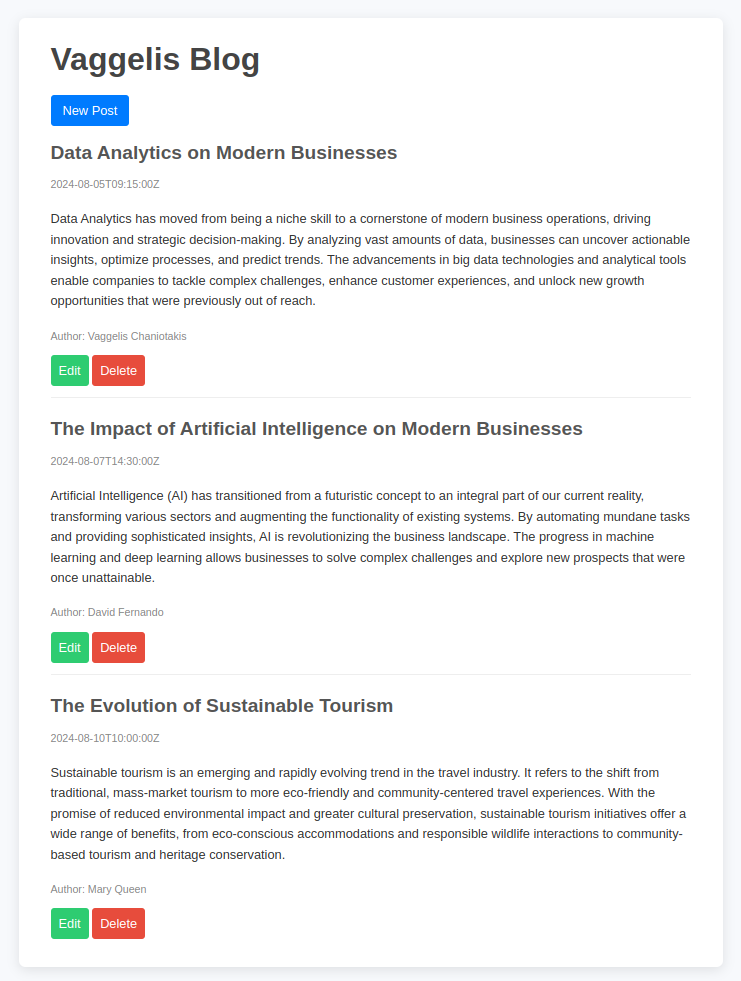

# Vaggelis Blog Project

This is my blog-api project.



## Project Setup

```sh
npm install
```

### Run Server

```sh
npx nodemon server.js
```

### Compile and Hot-Reload for Development

```sh
npx nodemon index.js
```

